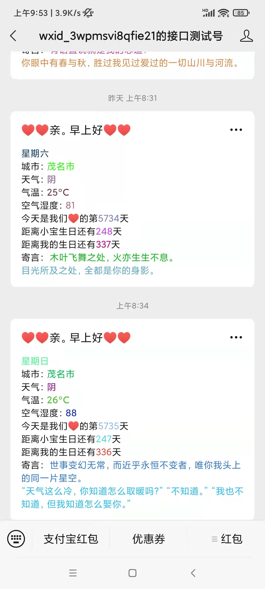

> 基于nodejs的微信公众号消息推送，用于情侣之间消息推送. main分支是基于github action的计划任务，而server分支是node的计划任务

### 注意
`原服务端部署的源码在本仓库的server分支, 想服务端部署的请切换server分支看md教程` 本分支是提供了github action部署

#### main分支功能
- [x] 更换第三方天气接口(高德天气，无需担心次数上限的白嫖问题)
- [x] github action部署

#### server分支功能
- [x] 定时消息推送/手动消息推动
- [x] 人工智障ai聊天
- [x] 更换第三方天气接口(高德天气，无需担心次数上限的白嫖问题)
- [x] 通过接口设置城市，方便修改城市重新获取天气(设置城市会直接清除天气缓存，目前天气缓存为10分钟)

#### github action部署
[关于github action请查看](./docs/githubAction.md)

> 不会可以提issue
