> 这个项目原项目是py的，后在小红书网友想要node版本的，所以做了一个。[原项目](https://github.com/erwanjun/weixin_tuisong)

#### 功能
- [x] 定时消息推送/手动消息推动
- [x] 人工智障ai聊天

#### 准备环境
+ redis
> 解决第三方接口频繁请求次数的问题，像第三方天气接口时有次数限制的, 而且一天请求一次就好,window用户可以用phpstudy方便安装;linux可以用宝塔安装;mac的话百度, phpstudy也有mac版本的,但是我没用过,我mac的redis是自己手动安装的
+ 花生壳
> 为了内网穿透做域名校验,注册就送一个免费的域名,够玩. 当然内网穿透工具并不只有这个,也可以用其他的.这里用花生壳内网穿透到本地的服务端口，理论上只要你电脑不关机，花生壳不挂，那么这个服务可以一直就这么使用,可以节约成本
+ 启动项目

```javascript
// 信息配置在config/config.default.js
// 公众号配置
config.wx = {
    appId: 'wx6a908ab36533ea40', // 公众号appid
    appSecret: '76d09eb43886a44cf2bb993c99206934', // 公众号密钥
    token: 'junetext', // 公众号接口配置token
    template_id: 'Z9NaV8KlzSR8-AA7Mb22PjqI1dwq0xggxeMUEjDbhGg', // 推送的模板id
    user: 'wx6a908ab36533ea40' // 公众号appid
}

config.userData = {
    mineBirth: '1994-03-24', // 自己的生日
    gfBirth: '1994-12-26', // 女朋友的生日
    loveDay: '2007-08-11', // 在一起的日期
    city: '广州' // 获取天气使用
}

// 第三方
config.apiConfig = {
    tianxing: {
        appKey: 'bcaddf1605dd53c3115c5a709082ac6f '
    }
}
```
```bash
# 先确定你启动了redis和安装了node
# 把项目拉或者下载到本地,然后在项目目录启动终端
npm install 
npm run start
```
+ 公众号配置
<p style="color: #f34250;">注意: 只有启动了服务端才可以配置这里, 另外域名换成你自己的域名，即https://www.xxxx.com/onWx</p>

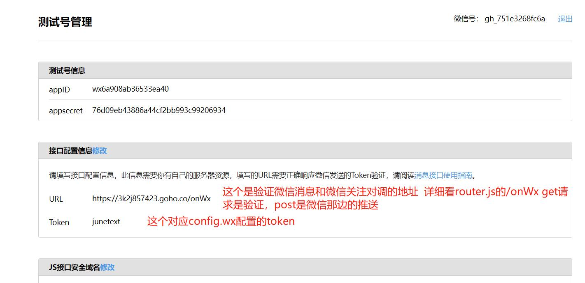

<p style="color: #f34250;font-size: 24px;">大家自己去申请个公众号吧,但是个人的是没办法做推送的. 可以申请测试的, 你和你对象都关注就可以了. 目前的推送是每天八点自动推送给关注的人.也有接口可以调接口推送</p>
<p style="color: #f34250;">目前的推送是每天八点自动推送给关注的人.也有接口可以调接口推送</p>

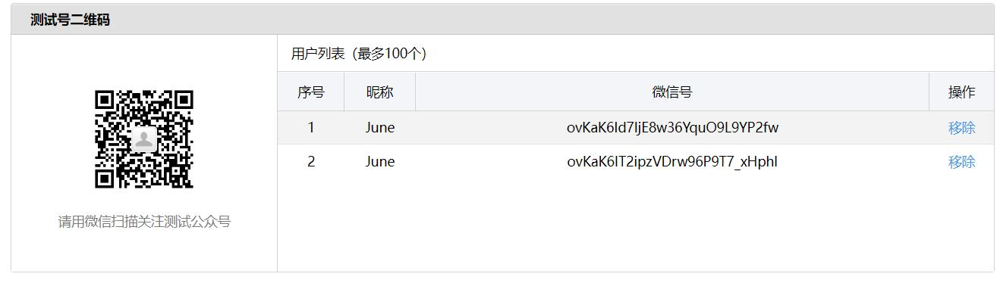

### 添加模板
<p style="color: #f34250;">这里的模板id对应的是config.wx的template_id</p>
<p style="color: #f34250;">模板的话复制下面代码,换行的话回车换行,不然推送的消息就不会换行的</p>

```
{{date.DATA}}
城市：{{city.DATA}}
天气：{{weather.DATA}}
最低气温: {{min_temperature.DATA}}
最高气温: {{max_temperature.DATA}}
降雨概率：{{pop.DATA}}
今日建议：{{tips.DATA}}
今天是我们恋爱的第{{love_day.DATA}}天
距离小宝生日还有{{gfBirthDays.DATA}}天
距离我的生日还有{{mineBirthDays.DATA}}天
寄言： {{lizhi.DATA}}
```

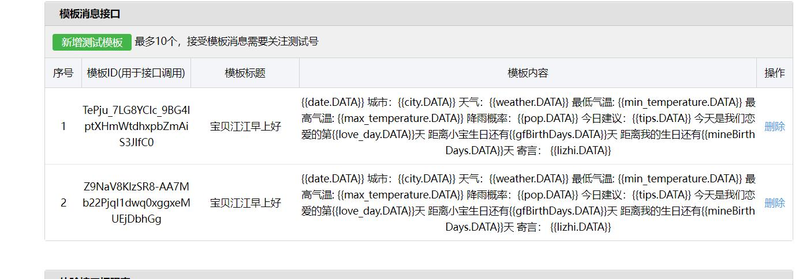

## 关于定时推送
> `app/schedule/sendTemplate.js`目前是通过eggjs的定时任务实现的, 在linux, window以及mac下都可以正常运行。目前配置是每天8点推送，[cron表达式请看](http://cron.ciding.cc/)。下面是利用window配置批处理文件执行发送（打不开图片的可以把下面下载下去，在gitPic目录看t0-t10的图片）

+ 因为不需要用node的定时任务，所以我们先注释

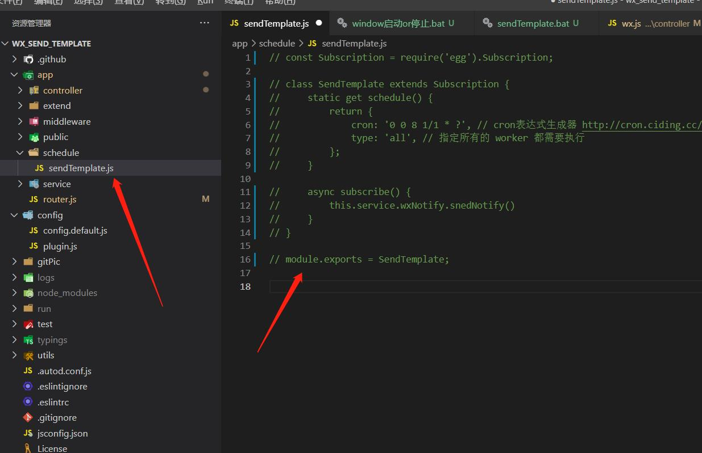

+ 找到window的控制面板在控制面板中找到管理工具

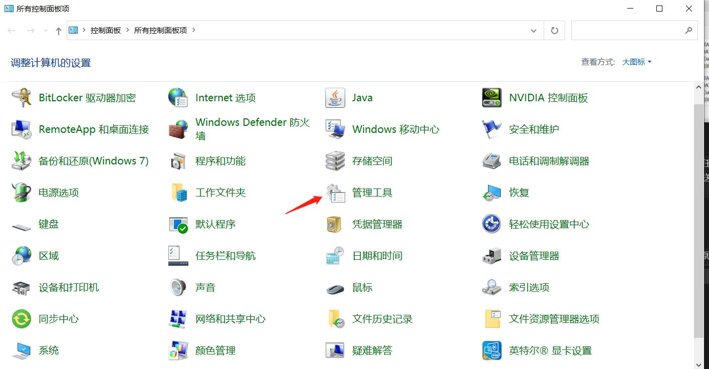

+ 创建基本任务

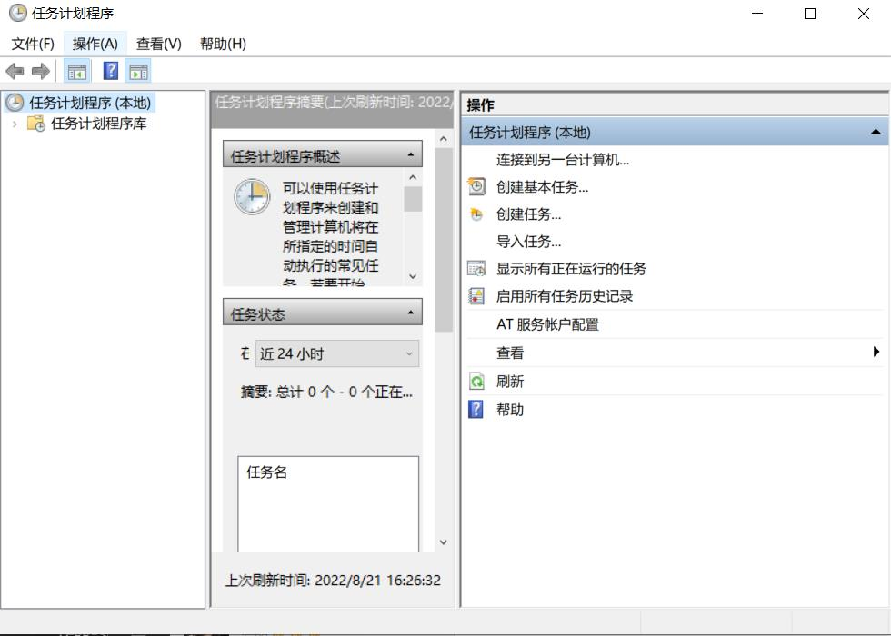

+ 创建基本任务02

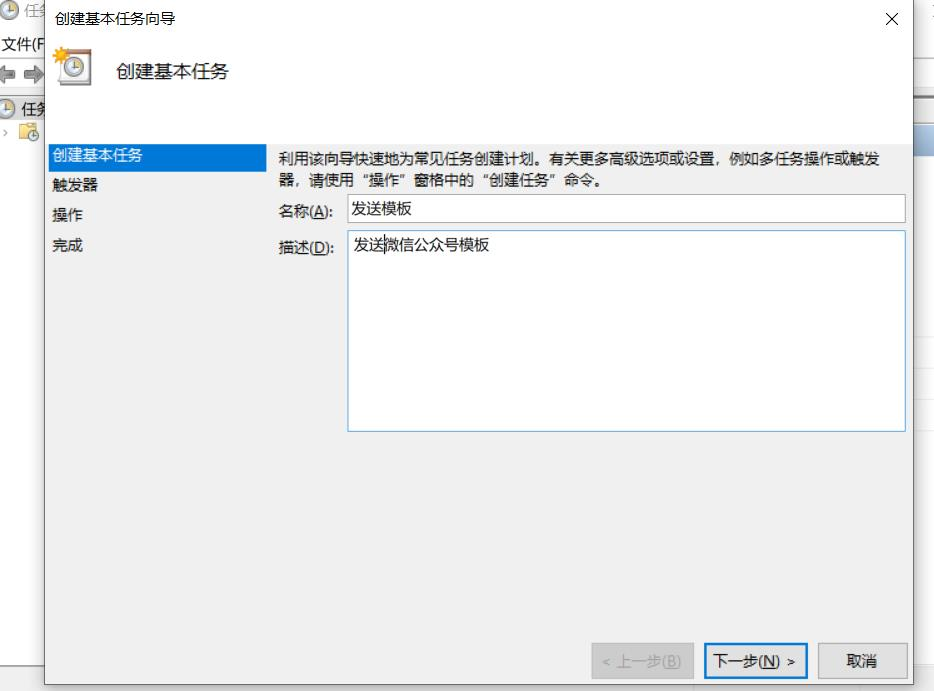

+ 配置任务向导

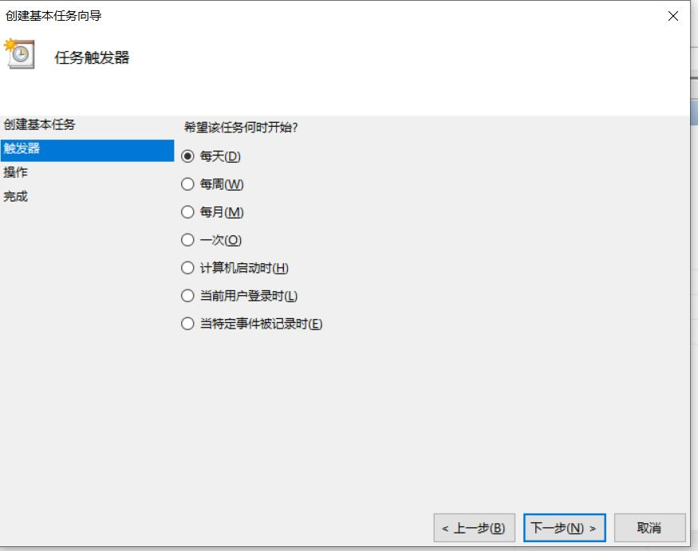

+ 配置任务向导02

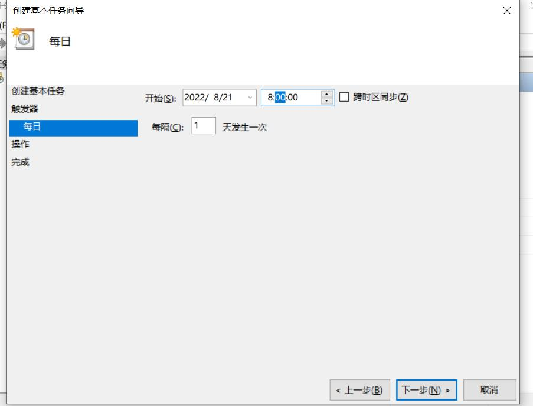

+ 启动程序

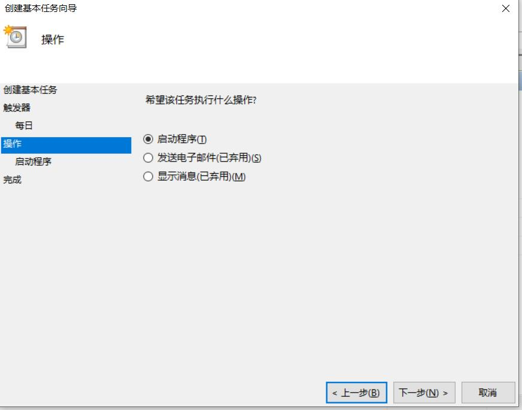

+ 配置bat目录

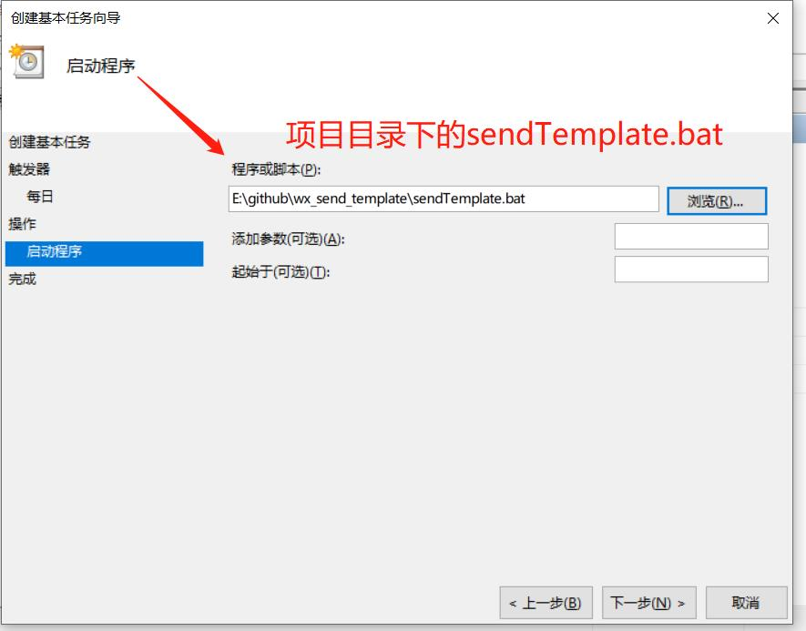

+ 创建任务完成

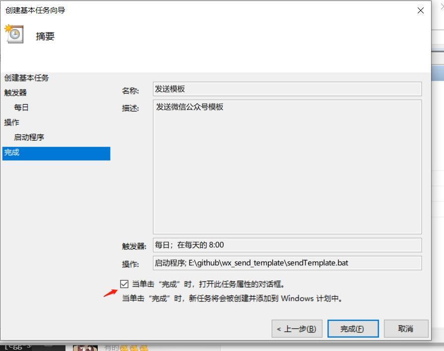

+ 在属性配置执行权限

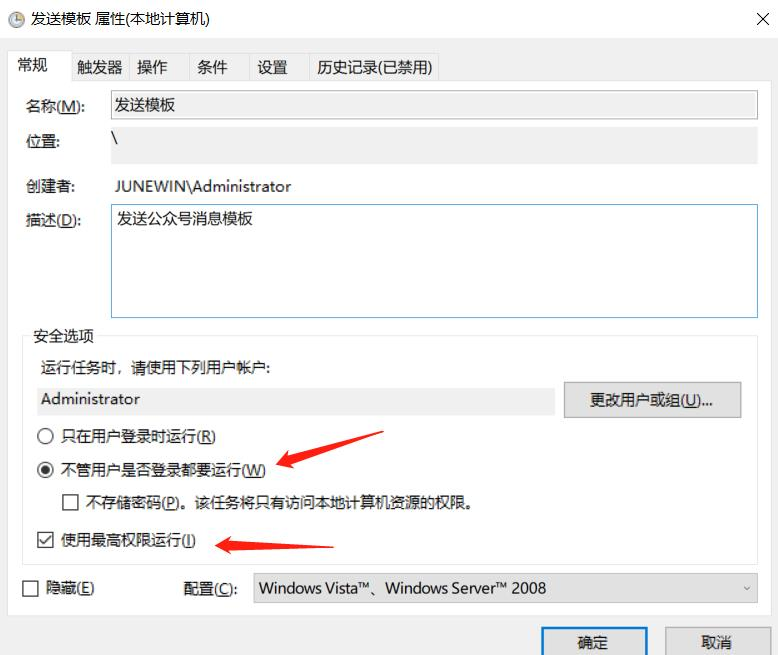

## 对接api实现
> 用的和原项目一样都是[天行](第三方用的都是https://www.tianapi.com/), 具体申请看=>[原项目的md](https://github.com/erwanjun/weixin_tuisong).我在原项目的基础上用redis进行了缓存减少请求次数

消息推送有三种方式
+ 调用接口推送(/sendNotify)
+ 自动推送(每天早上八点)
+ 通过公众号发送'发送模板'这个关键字


## 最后
部署起来也挺简单的, 不会的话可以加我微信 ***June_QIU_0324***或者提issue
<p style="color: #f34250;">有服务器和域名的我也可以帮忙部署</p>