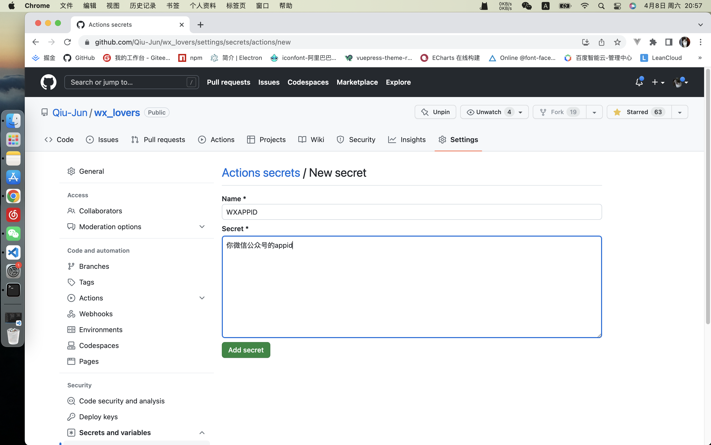

#### 关于github action
github action 可以设置运行环境`ubuntu`, `windows`和`macOs`, 设置windows的话可以直接执行这个项目目录下的`bat`文件，这里方法用的是`ubuntu`

+ 首先fork仓库到你自己的github帐号

+ 设置定时任务的时间
```yml
# 修改文件位置 .github/workflows/actions.yml的cron 
# 可以参考这个网站 http://cron.ciding.cc/
...
on:
	schedule:
		# utc时间，北京时间需要+8,如 '0 1 * * *',是1点，那么北京时间就是9点
		- cron: '0 22 * * *'
...
```

+ 准备下面几个api相关的key
    - 微信公众号(配置公众号可以切换server分支看md)
        - appid
        - 密钥
        - token
        - 模板id
        - [点击链接申请测试公众号](https://mp.weixin.qq.com/debug/cgi-bin/sandbox?t=sandbox/login)
    - 天行数据
        - 控制台拿key
        - 申请下面两个api
            - 彩虹屁
            - 励志古言
        - [点击链接跳转天行数据](https://www.tianapi.com/console/)
    - 高德开放平台
        - 控制创建应用拿key
        - [点击链接跳转高德开放平台](https://lbs.amap.com/?ref=https://console.amap.com/dev/key/app)

+ (你fork的仓库>`Settings`>`Secrets and variables`>`Actions`)添加变量(以设置WXAPPID为例子，其他都一样的方式)
    - WXAPPID 微信公众号的appid
    - WXSECRET 微信公众号的密钥
    - WXTOKEN 微信公众号的token
    - TEMPLATEID 微信公众号的模板id
    - TIANXINGKEY 第三方天行的的key
    - AMAPKEY 地图的key，用于获取天气
    - 例子:如下图



+ 测试
    - 启动action
    - 找到Timer
    - run workflow
